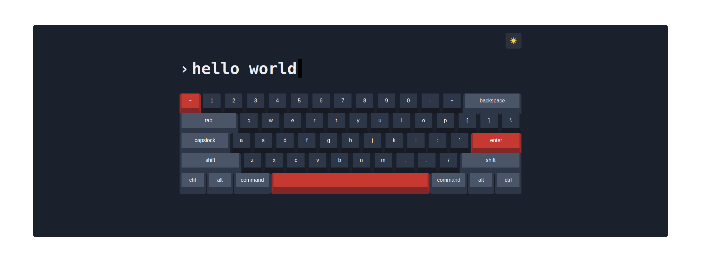

# Virtual Keyboard

⌨️ Mechanical Virtual Keyboard build with ⚛️ React

## 🚀 Demo

[Live demo](https://smartcrash.github.io/virtual-keyboard/)

## 📦 Installation

Clone the repo locally:

```sh
git clone https://github.com/smartcrash/virtual-keyboard
cd virtual-keyboard
```

Install NPM dependencies:

```sh
npm install
```

Build assets:

```sh
npm run build
```

Run the dev server (the output will give the address):

```sh
npm run dev
```

## 🧪 Running tests

To run the tests, run:

```
npm test
```
